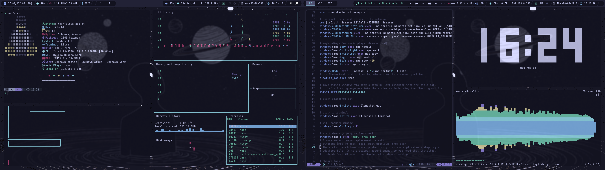
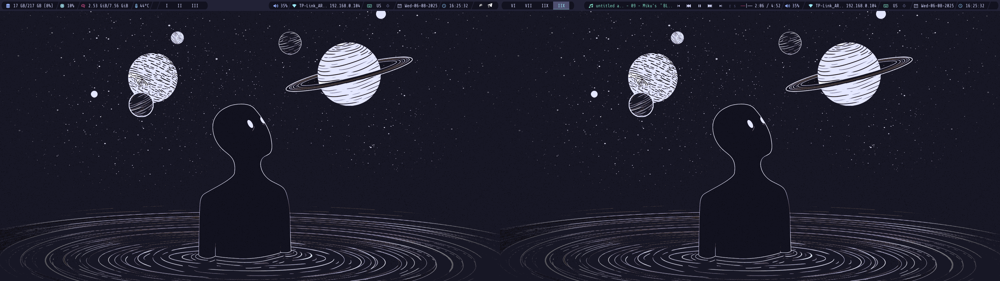

# With programs and tabs

# Wallpaper only

# Tools and Configuration
- OS: [Arch](https://wiki.archlinux.org/)
- WM: [i3wm](https://i3wm.org/)
- Status Bar: [Polybar](https://github.com/polybar/polybar)
- Shell: bash with [starship](https://starship.rs/)
- Compositor: [Picom](https://github.com/yshui/picom)
- Terminal Emulator: [kitty](https://github.com/kovidgoyal/kitty)
- Text Editor: [Neovim](https://github.com/neovim/neovim)
- Application Launcher: [Rofi](https://github.com/davatorium/rofi)
- Font: ShureTechMono Nerd Font
  - [Website](https://www.nerdfonts.com/)
  - [Zip file](https://github.com/ryanoasis/nerd-fonts/releases/download/v3.1.1/ShareTechMono.zip)
- Icons: [Kora](https://github.com/bikass/kora)
- Cursor Theme: [Catppouccin](https://github.com/catppuccin/cursors)
- Color Palette: [Eidolon](https://github.com/Vallen217/dotfiles/blob/main/color_palette.md)
- Wallpaper: [Fool's Moon Night](./wallpaper/lost-in-space.png)

# Unix P Ahh Tools
- System info summary: [neofetch](https://github.com/dylanaraps/neofetch)
- System Monitor: [gtop](https://github.com/aksakalli/gtop)
- pipes pattern: [pipes.sh](https://github.com/pipeseroni/pipes.sh)
- Music Visualizer: [Ncurses Music Player Client Plus Plus (ncmpcpp)](https://github.com/ncmpcpp/ncmpcpp)
- Terminal based clock: [peaclock](https://github.com/octobanana/peaclock)

# Changes
## [Polybar](https://github.com/polybar/polybar)
- tweaked layout
- added xkeyboard module
- added tray module
- added mpd module
- private ip details
- made things work with i3 a bit better (alerts)

## Rofi
- added emoji, power-menu plugins

## Picom
- changed opacity and added shadows

## neofetch
- added music player and private ip details
- changed thumbnail
